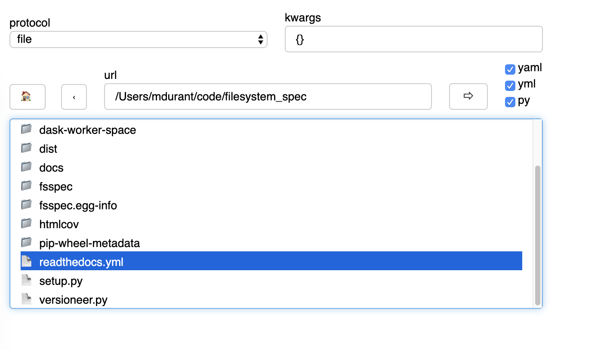

Features of fsspec
==================

Consistent API to many different storage backends. The general API and functionality were
proven with the projects `s3fs`_ and `gcsfs`_ (along with `hdfs3`_ and `adlfs`_), within the
context of Dask and independently. These have been tried and tested by many users and shown their
usefulness over some years. ``fsspec`` aims to build on these and unify their models, as well
as extract out file-system handling code from Dask which does not so comfortably fit within a
library designed for task-graph creation and their scheduling.

.. _s3fs: https://s3fs.readthedocs.io/en/latest/
.. _gcsfs: https://gcsfs.readthedocs.io/en/latest/
.. _hdfs3: https://hdfs3.readthedocs.io/en/latest/
.. _adlfs: https://docs.microsoft.com/en-us/azure/data-lake-store/

Here follows a brief description of some features of note of ``fsspec`` that promide to make
it an interesting project beyond some other file-system abstractions.

Serialisability
---------------

Coming out of the Dask stable, it was an important design decision that file-system instances
be serialisable, so that they could be created in one process (e.g., the client) and used in
other processes (typically the workers). These other processes may even be on other machines,
so in many cases they would need to be able to re-establish credentials, ideally without passing
sensitive tokens in the pickled binary data.

``fsspec`` instances, generally speaking, abide by these rules, do not include locks, files and other
thread-local material, and where possible, use local credentials (such as a token file)
for re-establishing sessions upon de-serialisation. (While making use of cached instances, where
they exist, see below).

``OpenFile`` instances
----------------------

The :func:`fsspec.core.OpenFile` class provides a convenient way to prescribe the manner to
open some file (local,
remote, in a compressed store, etc.) which is portable, and can also apply any compression and
text-mode to the file. These instances are also serialisable, because they do not contain any open
files.

The way to work with ``OpenFile`` s is to isolate interaction with in a ``with`` context. It is
the initiation of the context which actually does the work of creating file-like instances.

.. code-block:: python

    of = fsspec.open(url, ...)
    # of is just a place-holder
    with of as f:
        # f is now a real file-like object holding resources
        f.read(...)

Random Access and Buffering
---------------------------

The :func:`fsspec.spec.AbstractBufferedFile` class is provided as an easy way to build file-like
interfaces to some service which is capable of providing blocks of bytes. This class is derived
from in a number of the existing implementations. A subclass of ``AbstractBufferedFile`` provides
random access for the underlying file-like data (without downloading the whole thing) and
configurable read-ahead buffers to minimise the number of the read operations that need to be
performed on the back-end storage.

This is also a critical feature in the big-data access model, where each sub-task of an operation
may need on a small part of a file, and does not, therefore want to be forced into downloading the
whole thing.

Transparent text-mode and compression
-------------------------------------

As mentioned above, the ``OpenFile`` class allows for the opening of files on a binary store,
which appear to be in text mode and/or allow for a compression/decompression layer between the
caller and the back-end storage system. From the user's point of view, this is achieved simply
by passing arguments to the :func:`fsspec.open_files` or :func:`fsspec.open` functions, and
thereafter happens transparently.

Key-value stores
----------------

File-systems are naturally like dict-like key-value mappings: each (string) path corresponds to some
binary data on the storage back-end. For some use-cases, it is very convenient to be able to
view some path within the file-system as a dict-like store, and the function :func:`fsspec.get_mapper`
gives a one-stop way to return such an object. This has become useful, for example, in the
context of the `zarr`_ project, which stores it array chunks in keys in any arbitrary mapping-like
object.

.. code-block:: python

    mapper = fsspec.get_mapper('protocol://server/path', args)
    list(mapper)
    mapper[k] = b'some data'

.. _zarr: https://zarr.readthedocs.io/en/stable/

PyArrow integration
-------------------

`pyarrow`_ has its own internal idea of what a file-system is (``pyarrow.filesystem.FileSystem``),
and some functions, particularly the loading of parquet, require that the target be compatible.
As it happens, the design of the file-system interface in ``pyarrow`` *is* compatible with `fsspec`
(this is not by accident). Therefore at import time, ``fsspec`` checks for the existence of
``pyarrow``, and, if found, adds it to the superclasses of the spec base-class. In this manner,
all ``fsspec``-derived file-systems are also pyarrow file-systems, and can be used by pyarrow
functions.

.. _pyarrow: https://arrow.apache.org/docs/python/

Transactions
------------

``fsspec`` supports *transactions*, during which writing to files on a remote store are deferred
(typically put into a temporary location) until the transaction is over, whereupon the whole
transaction is finalised in a semi-atomic way, and all the files are moved/committed to their
final destination. The implementation of the details is file-system specific (and not all
support it yet), but the idea is,
that all files should get written or none, to mitigate against data corruption. The feature
can be used like

.. code-block:: python

    fs = fsspec.filesystem(...)
    with fs.transation:
        with fs.open('file1', 'wb') as f:
            f.write(b'some data')
        with fs.open('file2', 'wb') as f:
            f.write(b'more data')

Here, files 1 and 2 do not get moved to the target location until the transaction context finishes.
If the context finishes due to an (uncaught) exception, then the files are discarded and the
file target locations untouched.

The class :func:`fsspec.spec.Transaction` allows for fine-tuning of the operation, and every
``fsspec`` instance has an instance of this as an attribute ``.transaction`` to give access.

Note that synchronising transactions across multiple instances, perhaps across a cluster,
is a harder problem to solve, and the implementation described here is only part of the solution.

Mount anything with FUSE
------------------------

Any path of any file-system can be mapped to a local directory using pyfuse and
:func:`fsspec.fuse.run`. This feature is experimental, but basic file listing with
details, and read/write should generally be available to the extent that the
remote file-system provides enough information. Naturally, if a file-system is read-only,
then write operations will fail - but they will tend to fail late and with obscure
error messages such as "bad address".

Some specific quirks of some file-systems may cause confusion for FUSE. For example,
it is possible for a given path on s3 to be both a valid key (i.e., containing binary
data, like a file) and a valid prefix (i.e., can be listed to find subkeys, like a
directory). Since this breaks the assumptions of a normal file-system, it may not
be possible to reach all paths on the remote.

Instance Caching
----------------

In a file-system implementation class is marked as *cachable* (attribute ``.cachable``),
then its instances will
get stored in a class attribute, to enable quick look-up instead of needing to regenerate
potentially expensive connections and sessions. They key in the cache is a tokenisation of
the arguments to create the instance. The cache itself (attribute ``._cache``)
is currently a simple dict, but could in the future be LRU, or something more complicated,
to fine-tune instance lifetimes.

Since files can hold on to write caches and read buffers,
the instance cache may cause excessive memory usage in some situations; but normally, files
will get ``close``d, and the data discarded. Only when there is also an unfinalised transaction or
captured traceback might this be anticipated becoming a problem.

To disable instance caching, i.e., get a fresh instance which is not in the cache
even for a cachable class, pass ``skip_instance_cache=True``.

Listings Caching
----------------

For some implementations, getting file listings (i.e., ``ls`` and anything that
depends on it) is expensive. These implementations use dict-like instances of
:class:`fsspec.dircache.DirCache` to manage the listings.

The cache allows for time-based expiry of entries with the ``listings_expiry_time``
parameter, or LRU expiry with the ``max_paths`` parameter. These can be
set on any implementation instance that uses listings caching; or to skip the
caching altogether, use ``use_listings_cache=False``. That would be appropriate
when the target location is known to be volatile because it is being written
to from other sources.

When the ``fsspec`` instance writes to the backend, the method ``invalidate_cache``
is called, so that subsequent listing of the given paths will force a refresh. In
addition, some methods like ``ls`` have a ``refresh`` parameter to force fetching
the listing again.

File Buffering
--------------

Most implementations create file objects which derive from ``fsspec.spec.AbstractBufferedFile``, and
have many behaviours in common. These files offer buffering of both read and write operations, so that
communication with the remote resource is limited. The size of the buffer is generally configured
with the ``blocksize=`` kwargs at open time, although the implementation may have some minimum or
maximum sizes that need to be respected.

For reading, a number of buffering schemes are available, listed in ``fsspec.caching.caches``
(see :ref:`readbuffering`), or "none" for no buffering at all, e.g., for a simple read-ahead
buffer, you can do

.. code-block:: python

   fs = fsspec.filesystem(...)
   with fs.open(path, mode='rb', cache_type='readahead') as f:
       use_for_something(f)

URL chaining
------------

Some implementations proxy or otherwise make use of another filesystem implementation, such
as locally caching remote files, i.e., finding out what files exist using the remote implementation,
but actually opening the local copies upon access. Other examples include reading from a Dask worker
which can see file-systems the client cannot, and accessing a zip file which is being read from
another backend.

In such cases, you can specify the parameters exactly as specified in the implementation docstrings,
for the dask case something like

.. code-block:: python

    of = fsspec.open('dask://bucket/key', target_protocol='s3', target_options={'anon': True})

As a shorthand, particularly useful where you have multiple hops, is to "chain" the URLs with
the special separator ``"::"``. The arguments to be passed on to each of the implementations referenced
are keywed by the protocol names included in the URL. Here is the equivalent to the line above:

.. code-block:: python

   of = fsspec.open('dask::s3://bucket/key', s3={'anon': True})

A couple of more complicates cases:

.. code-block:: python

  of = fsspec.open_files('zip://*.csv::simplecache::gcs://bucket/afile.zip',
                         simplecache={'cache_storage': '/stored/zip/files'},
                         gcs={'project': 'my-project'})

reads a zip-file from google, stores it locally, and gives access to the contained CSV files. Conversely,

.. code-block:: python

  of = fsspec.open_files('simplecache::zip://*.csv::gcs://bucket/afile.zip',
                         simplecache={'cache_storage': '/stored/csv/files'},
                         gcs={'project': 'my-project'})

reads the same zip-file, but extracts the CSV files and stores them locally in the cache.

**For developers**: this "chaining" methods works by formatting the arguments passed to ``open_*``
into ``target_protocol`` (a simple string) and ``target_options`` (a dict) and also optionally
``fo`` (target path, if a specific file is required). In order for an implementation to chain
successfully like this, it must look for exactly those named arguments.

Caching Files Locally
---------------------

``fsspec`` allows you to access data on remote file systems, that is its purpose. However, such
access can often be rather slow compared to local storage, so as well as buffering (see above), the
option exists to copy files locally when you first access them, and thereafter to use the local data.
This local cache of data might be temporary (i.e., attached to the process and discarded when the
process ends) or at some specific location in your local storage.

Two mechanisms are provided, and both involve wrapping a `target` filesystem. The following example
creates a file-based cache.

.. code-block:: python

   fs = fsspec.filesystem("filecache", target_protocol='s3', target_options={'anon': True},
                          cache_storage='/tmp/files/')

Each time you open a remote file on S3, it will first copy it to
a local temporary directory, and then all further access will use the local file. Since we specify
a particular local location, the files will persist and can be reused from future sessions, although
you can also set policies to have cached files expire after some time, or to check the remote file system
on each open, to see if the target file has changed since it was copied.

With the top-level functions ``open``, ``open_local`` and ``open_files``, you can use the
same set of kwargs as the example above, or you can chain the URL - the following would
be the equivalent

.. code-block:: python

    of = fsspec.open("filecache::s3://bucket/key",
                     s3={'anon': True}, filecache={'cache_storage'='/tmp/files'})

With the "blockcache" variant, data is downloaded block-wise: only the specific parts of the remote file
which are accessed. This means that the local copy of the file might end up being much smaller than the
remote one, if only certain parts of it are required.

Whereas "filecache" works for all file system implementations, and provides a real local file for other
libraries to use, "blockcache" has restrictions: that you have a storage/OS combination which supports
sparse files, that the backend implementation uses files which derive ``from AbstractBufferedFile``,
and that the library you pass the resultant object to accepts generic python file-like objects. You
should not mix block- and file-caches in the same directory. "simplecache" is the same as "filecache",
except without the options for cache expiry and to check the original source - it can be used where the
target can be considered static, and particularly where a large number of target files are expected
(because no metadata is written to disc). Only "simplecache" is guaranteed thread/process-safe.

Remote Write Caching
--------------------

You can cache files to local files to send to remote using the "simplecache" protocol.
The following example demonstrates how this might look

.. code-block:: python

   with fsspec.open('simplecache::s3://mybucket/myfile', 'wb',
                    s3={"profile": "writer"}) as f:
       f.write(b"some data")

This will open a local file for writing, and when this file is closed, it will be uploaded
to the target URL, in this case on S3. The file-like object ``f`` can be passed to any
library expecting to write to a file. Note that we pass parameters to ``S3FileSystem`` using
the key ``"s3"``, the same as the name of the protocol.

File Selector
-------------

The module ``fsspec.gui`` contains a graphical file selector interface. It is built
using `panel`_, which must be installed in order to use the GUI. Upon instantiation,
you can provide the initial URL location (which can be returned to with the "🏠" button),
arguments and filters.

.. _panel: https://panel.holoviz.org/

Clicking on a directory will descend into it, and selecting a file will mark it as
the output of the interface. You can select any of the known protocols, but should
provide any required arguments in the "kwargs" box (as a dictionary) and any
absolute URL location before clicking "⇨" to go to that location. If using file filters,
they will appear as a list of checkboxes; only those file-endings selected will be
shown (or if none are selected, all files are shown).

The interface provides the following outputs:

- ``.urlpath``: the currently selected item (if any)
- ``.storage_options``: the value of the kwargs box
- ``.fs``: the current filesystem instance
- ``.open_file()``: produces an ``OpenFile`` instance for the current selection
